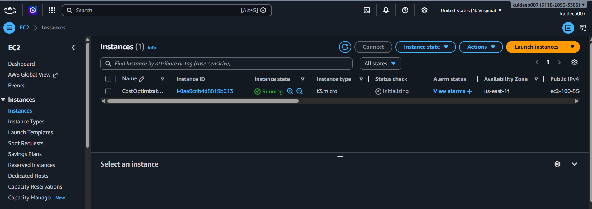
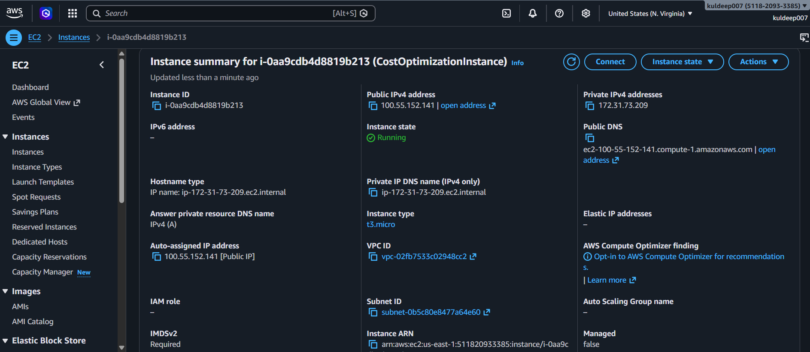
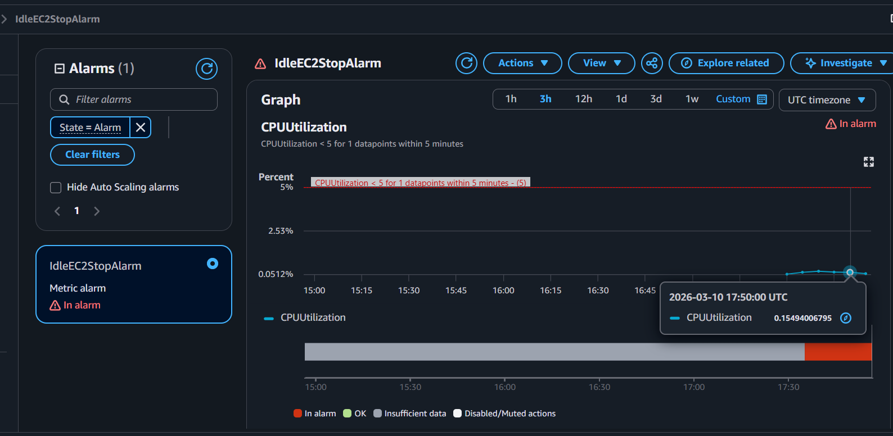
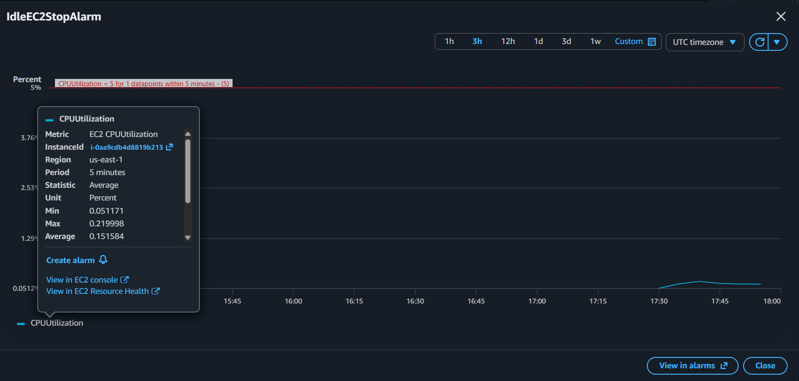
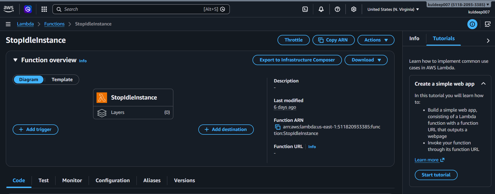
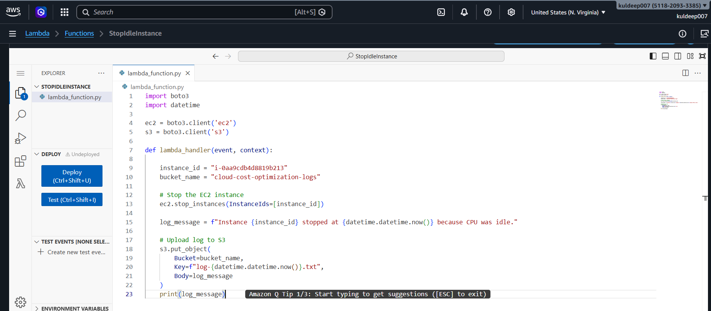
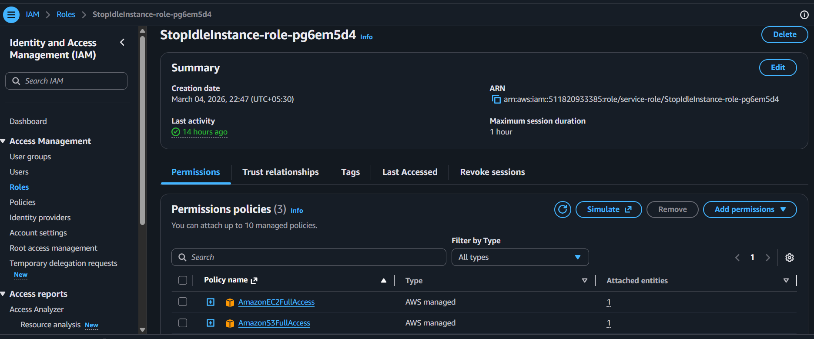
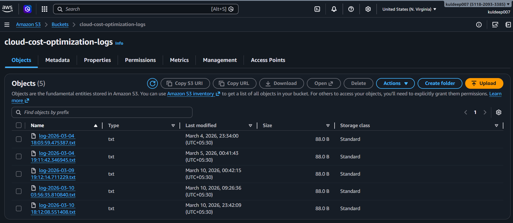
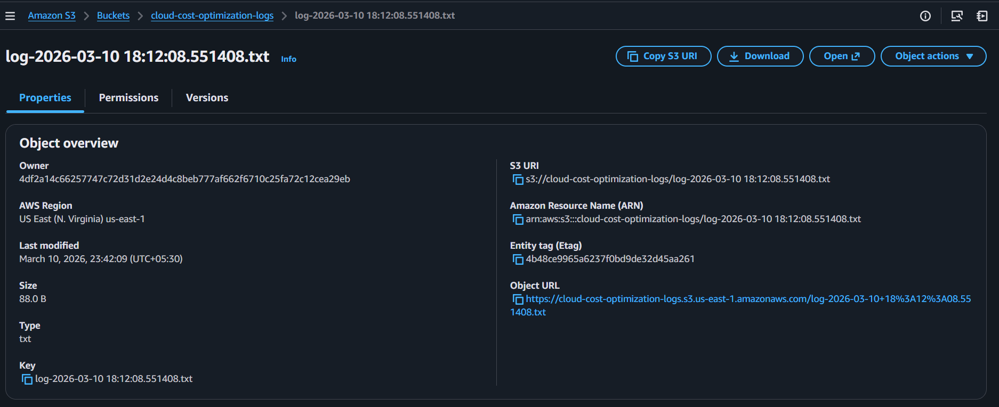

# AWS Cloud Cost Optimization System

An automated cloud resource optimization system built on AWS that detects idle EC2 instances and automatically stops them to reduce unnecessary cloud costs.

This project demonstrates how monitoring, automation, and serverless technologies can be used to build efficient and cost-aware cloud infrastructure.

---

# Project Overview

Cloud platforms charge based on resource usage. In many organizations, virtual machines remain running even when they are not actively used, leading to unnecessary costs.

This project solves that problem by building an automated monitoring system that detects idle EC2 instances and stops them automatically.

The system continuously monitors EC2 CPU utilization using Amazon CloudWatch. When the CPU usage falls below a defined threshold, a CloudWatch alarm triggers an AWS Lambda function that stops the instance and records the action in Amazon S3.

This demonstrates a practical implementation of **cloud cost optimization using serverless automation**.

---

# Architecture

EC2 Instance  
↓  
CloudWatch Monitoring  
↓  
CloudWatch Alarm Trigger  
↓  
AWS Lambda Function  
↓  
Stop Idle EC2 Instance  
↓  
Store Automation Log in S3

---

# Technologies Used

- **AWS EC2** – Compute resource being monitored
- **AWS CloudWatch** – Monitoring and alarm configuration
- **AWS Lambda** – Serverless automation function
- **AWS IAM** – Secure permission management
- **AWS S3** – Storage for automation logs
- **Python (boto3)** – AWS SDK used inside Lambda

---

# How the System Works

1. An EC2 instance is running in the AWS environment.
2. Amazon CloudWatch continuously monitors the CPU utilization of the instance.
3. A CloudWatch alarm is configured to trigger when CPU utilization drops below a defined threshold.
4. When the alarm is triggered, it invokes an AWS Lambda function.
5. The Lambda function uses the AWS boto3 SDK to stop the idle EC2 instance.
6. A log file describing the action is stored in an Amazon S3 bucket.

This workflow demonstrates **event-driven automation using serverless cloud services**.

---

# Lambda Function Logic

The Lambda function performs the following actions:

- Connects to AWS services using boto3
- Stops the EC2 instance when triggered
- Generates a timestamped log message
- Stores the log file in an S3 bucket

This ensures that every automation action is recorded for auditing and monitoring.

---

# Screenshots

## EC2 Instance

The EC2 instance that is being monitored for CPU utilization.

---

## CloudWatch Alarm

CloudWatch alarm configured to detect low CPU utilization and trigger automation.

---

## Lambda Function

AWS Lambda function written in Python using boto3 to automatically stop idle EC2 instances.

---

## IAM Permissions

IAM role that grants Lambda permission to interact with EC2 and S3 services.

---

## S3 Automation Logs

Logs generated by the Lambda function are stored in Amazon S3 for tracking and auditing.

---

# Project Structure

aws-cloud-cost-optimization
│
├── README.md
├── lambda
│ └── stop_idle_instance.py
├── architecture
│ └── architecture-diagram.png
├── screenshots
│
│ ├── ec2-instance
│ ├── cloudwatch-alarm
│ ├── lambda-function
│ ├── iam-permissions
│ └── S3-logs
│
└── docs
└── project-explanation.md

---

# Key Learning Outcomes

This project demonstrates:

- Serverless cloud automation
- Cloud resource monitoring
- Event-driven architecture
- Infrastructure cost optimization
- Secure cloud permissions using IAM

---

# Future Improvements

Possible improvements for this system include:

- Monitoring multiple EC2 instances automatically
- Sending email alerts when instances are stopped
- Building a cloud cost dashboard
- Integrating AWS Cost Explorer APIs
- Extending the system to support auto-scaling environments

---

# Author

Kuldeep Gheghate  
Computer Engineering Student – PCCOE  

GitHub:  
https://github.com/KuldeepShivajiraoGheghate/aws-cloud-cost-optimization
